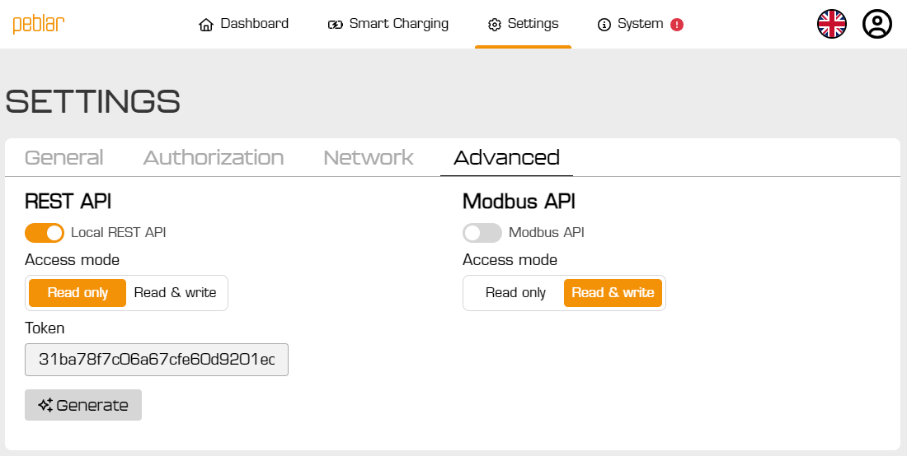

# Peblar API

Home Assistant custom integration for local monitoring and control of a Peblar EV charger via the REST API.

[](https://my.home-assistant.io/redirect/hacs_repository/?owner=domoriks&repository=peblar_api&category=integration)
[](https://my.home-assistant.io/redirect/config_flow_start/?domain=peblar_api)

## Disclaimer

- This is an unofficial project and is not affiliated with, endorsed by, or supported by Peblar.
- It is built and maintained by a single developer with a personal Peblar charger.
- Use this integration at your own risk. The developer is not responsible for any damage, charging issues, data loss, or other consequences.

## Features

- UI-based setup with host and API token (no YAML required).
- Local API polling for `system`, `meter`, and `evinterface` data.
- 27 sensor entities for diagnostics and charging data.
- 1 number entity for charge current limit control.
- Built-in duplicate prevention using charger serial number as unique ID.

## Installation

### HACS (recommended)

1. Open HACS in Home Assistant.
2. Add this repository as a custom repository if needed:
   - URL: `https://github.com/domoriks/peblar_api`
   - Category: `Integration`
3. Install **Peblar API** from HACS.
4. Restart Home Assistant.

### Manual installation

1. Copy `custom_components/peblar_api` into your Home Assistant `custom_components` folder.
2. Restart Home Assistant.

## Configuration

### Enable local REST API first

Before adding the integration in Home Assistant, enable the local REST API on your charger and create a token.

- Follow the Peblar documentation: https://developer.peblar.com/local-rest-api#section/General
- Enable the local REST API on the charger.
- Create an API token with **Read/Write** permissions.

> Important: The API token must be **Read/Write**. A read-only token is not enough for charger control features (for example setting charge current limit).



1. Go to `Settings -> Devices & Services`.
2. Click `Add Integration`.
3. Search for `Peblar API`.
4. Enter `IP address or hostname`.
5. Enter `API token` (must have **Read/Write** permissions).

## Entities

This integration currently creates these platforms:

Platform | Description
-- | --
`sensor` | Firmware, serial/model info, uptime, signal strength, warnings/errors, phase current/voltage/power, total/session energy, EV charge state and limits
`number` | Charge current limit (amps, slider; writes to Peblar `ChargeCurrentLimit`)

## Troubleshooting

- `cannot_connect`: Verify charger host/IP and network reachability.
- `invalid_auth`: Verify your local API token.
- `already_configured`: The charger is already set up in Home Assistant.

Enable debug logging in `configuration.yaml`:

```yaml
logger:
  default: info
  logs:
    custom_components.peblar_api: debug
```

## Repository structure

```text
custom_components/peblar_api/
  __init__.py
  api.py
  config_flow.py
  const.py
  coordinator.py
  manifest.json
  number.py
  sensor.py
  strings.json
  brand/
  translations/
```

## HACS publishing notes

- `hacs.json` is included in the repository root.
- Integration files are under `custom_components/peblar_api`.
- `manifest.json` includes required HACS keys and a version.
- Brand assets exist in `custom_components/peblar_api/brand`.

Before requesting inclusion in default HACS repositories, make sure your GitHub repository metadata is set:

- Add a clear repository description.
- Add relevant topics like `home-assistant`, `hacs`, `homeassistant-integration`.
- Publish GitHub releases for versioned installs.
